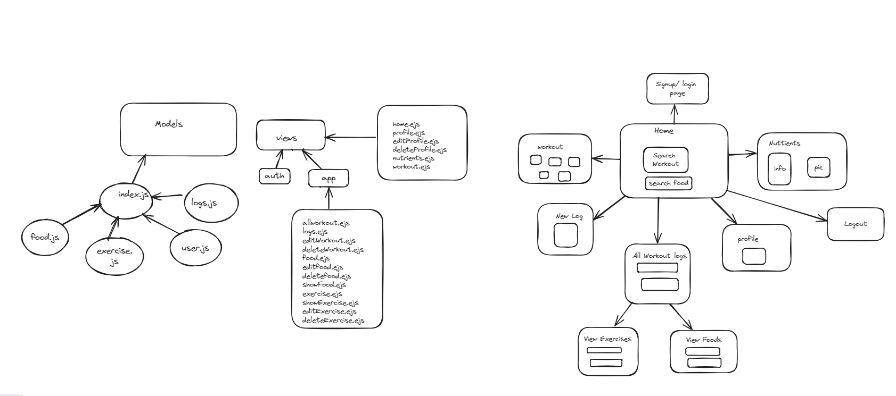

# Fitness App

### Purpose: 
The purpose of this project is proviede users ability to find information regarding their workouts via api calls and help them to find the important information regarding their daily meals sunch as calories and nutrients info. Also, users can create, update and delete their daily logs, exercises and foods. 

### MVP:
- User Authentication    
- Logging Workouts
- Logging exercies respective to workouts
- Documneting food respective to daily logs and exercises
- Profile Management
- Youtube api call to show videos to users according to their workout
- Nutritionx api call to show users the information regarding their foods

### User Stories:
1. Allow new users to sign-up or let existing users to login with their existing credentials. Make the user's credentials secure by hashing the password.
2. Let users to log their workouts, they can add the workout that they want to do, view their previous workouts or edit/delete their workouts.
3. Allow users to add their individual exercises, where they can edit or delete exercises according to thie requirements with respective to their logs.
4. Allow users to document, edit and delete their reagular meals according to their logs and exercises.
5. Allow users to view, edit or delete their profile.
6. Use api calls to show users the workout videos.
7. Use api call give users information rearding the micro-nutrients in their foods.

### HOW TO INSTALL
1. ``Fork`` and ``clone`` the respository in your local machine.
2. Open directory in vscode or any editor to view or to make edits in the code

## Wireframe:

## ERD:

### User
id, name, email, phne, password, weight, height, gender, level, goal, created_at, updated_at

### logs
id, date, total_sets, reps_forEach_Set, total_duration, total_distance, created_at, updated_at

### exercise
id, type, duration, intensity, sets, reps, notes, created_at, updated_at

