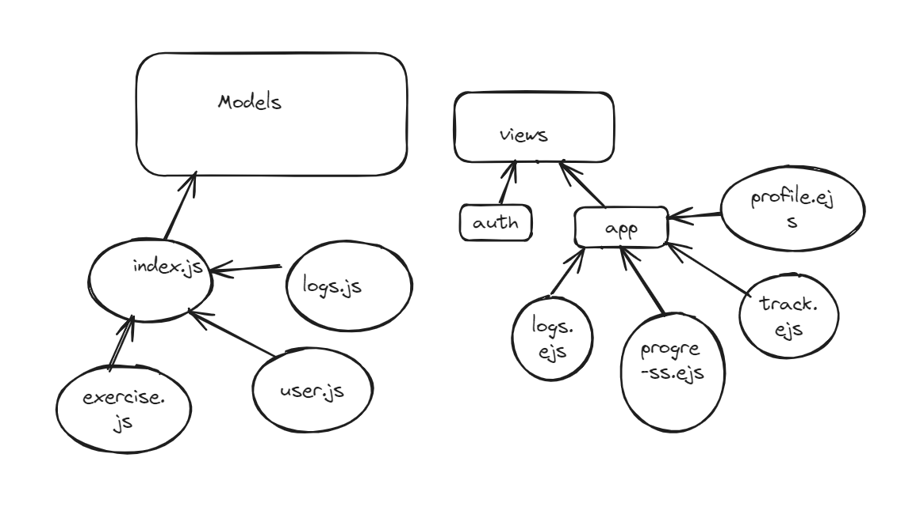

# Fitness Tracker

MVP:
- User Authentication    
- Logging Workouts
- Tracking Progress
- Profile Management

### User Stories:
1. Allow new users to sign-up or let existing users to login with their existing credentials. Make the user's credentials secure by hashing the password
2. Let users to log their workouts, they can add the workout that they want to do, view their previous workouts or edit/delete their workouts
3. Allow users to add their individua exercises, where they can edit or delete exercises according to thie requirements
4. Allow users to track their workouts progress by using the progress charts
5. Allow users to view or edit their profile

## Wireframe:

## ERD:

### User
id, name, email, password, created_at, updated_at

### logs
id, date, total_sets, reps_forEach_Set,  created_at, updated_at

### exercise
id, type, duration, intensity, sets, reps, notes, created_at, updated_at

